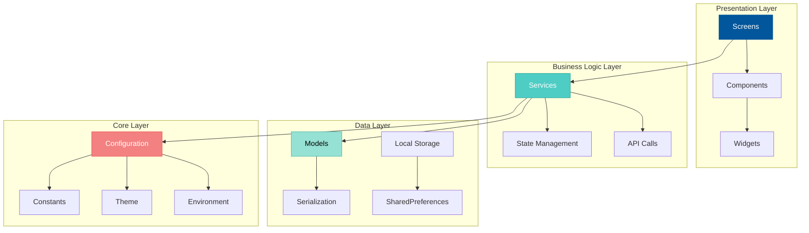
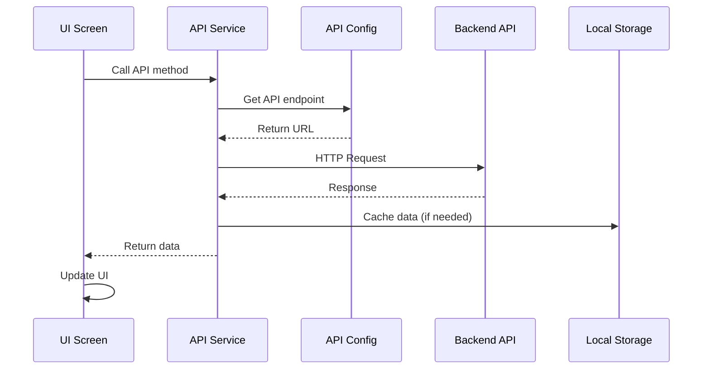

<div align="center">

# 📱 THISJOWI Frontend


### Cross-Platform Flutter Application

[](https://flutter.dev)
[](https://dart.dev)
[](https://github.com/TU_USUARIO/TU_REPO/actions/workflows/security-scan.yml)
[](../LICENSE)

[🎯 Features](#-features) •
[🚀 Quick Start](#-quick-start) •
[📚 Documentation](#-documentation) •
[🔒 Security](#-security) •
[🤝 Contributing](#-contributing)

</div>

---

## 📋 Table of Contents

- [Overview](#-overview)
- [Features](#-features)
- [Screenshots](#-screenshots)
- [Prerequisites](#-prerequisites)
- [Installation](#-installation)
- [Configuration](#️-configuration)
- [Running the App](#-running-the-app)
- [Project Structure](#-project-structure)
- [Architecture](#️-architecture)
- [Testing](#-testing)
- [Building for Production](#-building-for-production)
- [Security](#-security)
- [Troubleshooting](#-troubleshooting)
- [Contributing](#-contributing)
- [License](#-license)

---

## 🎯 Overview

**THISJOWI Frontend** is a modern, cross-platform application built with Flutter that provides a beautiful and intuitive interface for managing notes and passwords securely. It connects to the THISJOWI microservices backend.

### Supported Platforms

- 🤖 **Android** (5.0+)
- 🍎 **iOS** (11.0+)
- 💻 **macOS** (10.14+)
- 🪟 **Windows** (10+)
- 🌐 **Web** (Modern browsers)
- 🐧 **Linux** (Ubuntu 18.04+)

---

## ✨ Features

<details>
<summary><b>🔐 Authentication & Security</b></summary>

- ✅ OAuth2 authentication flow
- ✅ JWT token management with secure storage
- ✅ Biometric authentication (iOS/macOS)
- ✅ Session management
- ✅ Automatic token refresh
- ✅ Secure logout

</details>

<details>
<summary><b>📝 Notes Management</b></summary>

- ✅ Create, read, update, delete notes
- ✅ Rich text editing
- ✅ Tagging system
- ✅ Search and filter
- ✅ Offline support (coming soon)
- ✅ Cloud sync

</details>

<details>
<summary><b>🔑 Password Manager</b></summary>

- ✅ Secure password storage
- ✅ Password strength validator
- ✅ Category organization
- ✅ Search functionality
- ✅ Copy to clipboard
- ✅ Website launcher integration

</details>

<details>
<summary><b>🎨 User Interface</b></summary>

- ✅ Material Design 3
- ✅ Dark/Light theme support
- ✅ Responsive layouts
- ✅ Smooth animations
- ✅ Custom color schemes
- ✅ Accessible design

</details>

<details>
<summary><b>🌐 Networking</b></summary>

- ✅ RESTful API integration
- ✅ Environment-based configuration
- ✅ Request/Response interceptors
- ✅ Error handling
- ✅ Timeout management
- ✅ Retry logic

</details>

---

## 📸 Screenshots

<div align="center">

| Home Page | OTP Page | Login page |
|--------------|----------------|------------------|
|  |  |  |

</div>

---

## 📋 Prerequisites

Before you begin, ensure you have the following installed:

### Required

- [ ] **Flutter SDK** 3.9.0 or higher
- [ ] **Dart SDK** 3.9.0 or higher
- [ ] **Git**

### Platform-Specific

#### For Android Development
- [ ] Android Studio or VS Code with Flutter extension
- [ ] Android SDK (API 21+)
- [ ] Java Development Kit (JDK) 11+

#### For iOS/macOS Development (macOS only)
- [ ] Xcode 14.0+
- [ ] CocoaPods
- [ ] iOS Simulator or physical device

#### For Windows Development (Windows only)
- [ ] Visual Studio 2022 with Desktop development with C++

#### For Linux Development (Linux only)
- [ ] Clang, CMake, Ninja, pkg-config, GTK3 development files

### Verification

```bash
# Check Flutter installation
flutter doctor -v

# Expected output: All checks should pass for your target platform
```

---

## 🚀 Installation

### 1️⃣ Clone the Repository

```bash
# If cloning the entire project
git clone https://github.com/THISJOWI/client.git
cd THISJOWI/application
```

### 2️⃣ Install Dependencies

```bash
# Get Flutter packages
flutter pub get

# Verify installation
flutter doctor
```

### 3️⃣ Configure Environment

```bash
# Copy environment template
cp .env.example .env

# Edit .env with your configuration (see Configuration section)
nano .env  # or use your preferred editor
```

### 4️⃣ Generate Icons (Optional)

```bash
# Generate app icons for all platforms
flutter pub run flutter_launcher_icons
```

---

## ⚙️ Configuration

### Environment Variables

Create a `.env` file in the root directory with the following variables:

```bash
# ==========================================
# NETWORK CONFIGURATION
# ==========================================

# Local network IP address for accessing the API from physical devices
# For emulator/simulator, use localhost or 127.0.0.1
# For physical devices, use your computer's local IP (e.g., 192.168.1.100)
LOCAL_NETWORK_IP=192.168.1.100

# Cloud Gateway port number (default: 8080)
GATEWAY_PORT=8080

# ==========================================
# SERVICE ENDPOINTS (API Paths)
# ==========================================

# Authentication service path
AUTH_SERVICE_URL=/api/auth

# Notes service path
NOTES_SERVICE_URL=/api/notes

# Passwords service path
PASSWORD_SERVICE_URL=/api/passwords

# ==========================================
# HTTP CONFIGURATION
# ==========================================

# Request timeout in seconds (how long to wait for a response)
REQUEST_TIMEOUT=15

# ==========================================
# DEBUG CONFIGURATION
# ==========================================

# Enable debug mode (shows detailed logs)
# Values: true or false
DEBUG_MODE=true
```

### Configuration for Different Environments

<details>
<summary><b>Development (Local Backend)</b></summary>

```bash
LOCAL_NETWORK_IP=127.0.0.1
GATEWAY_PORT=8080
DEBUG_MODE=true
```

</details>

<details>
<summary><b>Development (Physical Device)</b></summary>

```bash
# Find your IP: ipconfig (Windows) or ifconfig (Mac/Linux)
LOCAL_NETWORK_IP=192.168.1.100
GATEWAY_PORT=8080
DEBUG_MODE=true
```

</details>

### Add `.env` to Assets

Ensure `.env` is listed in `pubspec.yaml`:

```yaml
flutter:
  assets:
    - .env
    - assets/logo.png
```

**⚠️ SECURITY WARNING:** Never commit the `.env` file to version control!

---

## 🎮 Running the App

### Run on Available Devices

```bash
# List available devices
flutter devices

# Run on default device
flutter run

# Run on specific device
flutter run -d [device-id]
```

### Platform-Specific Commands

#### Android
```bash
# Run on connected Android device
flutter run -d android

# Run on specific emulator
flutter emulators --launch <emulator-id>
flutter run -d <emulator-id>
```

#### iOS
```bash
# Run on connected iOS device
flutter run -d ios

# Run on iOS Simulator
open -a Simulator
flutter run -d "iPhone 15 Pro"
```

#### Web
```bash
# Run on Chrome
flutter run -d chrome

# Run on Edge
flutter run -d edge

# Run on specific port
flutter run -d web-server --web-port=8000
```

#### macOS
```bash
flutter run -d macos
```

#### Windows
```bash
flutter run -d windows
```

#### Linux
```bash
flutter run -d linux
```

### Run Modes

```bash
# Debug mode (default)
flutter run

# Profile mode (performance profiling)
flutter run --profile

# Release mode (optimized)
flutter run --release
```

### Hot Reload

While running in debug mode:
- Press `r` - Hot reload (fast refresh)
- Press `R` - Hot restart (full restart)
- Press `p` - Show performance overlay
- Press `o` - Toggle platform (iOS/Android)
- Press `q` - Quit

---

## 📁 Project Structure

```
application/
│
├── 📱 lib/                           # Main source code
│   ├── main.dart                    # Application entry point
│   │
│   ├── 🎨 components/               # Reusable UI components
│   │   ├── bottomNavigation.dart   # Bottom navigation bar
│   │   ├── button.dart             # Custom buttons
│   │   └── error_snack_bar.dart    # Error notifications
│   │
│   ├── ⚙️ core/                      # Core utilities & config
│   │   ├── api_config.dart         # API configuration
│   │   ├── app_theme.dart          # Theme configuration
│   │   ├── appColors.dart          # Color constants
│   │   ├── env_loader.dart         # Environment loader
│   │   └── exceptions.dart         # Custom exceptions
│   │
│   ├── 📊 models/                   # Data models
│   │   ├── note.dart               # Note model
│   │   └── password_entry.dart     # Password entry model
│   │
│   ├── 📺 screens/                  # Application screens
│   │   ├── auth/                   # Authentication screens
│   │   │   ├── LoginScreen.dart
│   │   │   └── RegisterScreen.dart
│   │   │
│   │   ├── main/                   # Main app screens
│   │   │   ├── HomeScreen.dart
│   │   │   ├── NotesScreen.dart
│   │   │   ├── AddNoteScreen.dart
│   │   │   ├── PasswordsScreen.dart
│   │   │   ├── AddPasswordScreen.dart
│   │   │   └── EditPasswordScreen.dart
│   │   │
│   │   ├── onboarding/             # Onboarding flow
│   │   │   └── OnboardingScreen.dart
│   │   │
│   │   └── splash/                 # Splash screen
│   │       └── SplashScreen.dart
│   │
│   └── 🔌 services/                 # API & Business logic
│       ├── auth_service.dart       # Authentication API
│       ├── notes_service.dart      # Notes API
│       └── password_service.dart   # Password API
│
├── 🎨 assets/                       # Static assets
│   └── logo.png                    # App logo
│
├── 🤖 android/                      # Android native code
│   ├── app/
│   │   ├── build.gradle.kts       # Android build config
│   │   └── src/                    # Android source
│   └── .gitignore                  # Android gitignore
│
├── 🍎 ios/                          # iOS native code
│   ├── Runner/
│   │   └── Info.plist              # iOS configuration
│   └── .gitignore                  # iOS gitignore
│
├── 💻 macos/                        # macOS native code
├── 🪟 windows/                      # Windows native code
├── 🐧 linux/                        # Linux native code
├── 🌐 web/                          # Web configuration
│
├── 🧪 test/                         # Unit & widget tests
│   └── widget_test.dart
│
├── ⚙️ .github/                      # GitHub configuration
│   ├── workflows/                  # CI/CD workflows
│   │   ├── security-scan.yml
│   │   ├── credentials-check.yml
│   │   └── README.md
│   └── SECURITY_CHECKLIST.md
│
├── 📄 .env.example                  # Environment template
├── 📄 .gitignore                    # Git ignore rules
├── 📄 analysis_options.yaml         # Dart analyzer config
├── 📄 pubspec.yaml                  # Dependencies
├── 📄 README.md                     # This file
├── 📄 CONTRIBUTING.md               # Contribution guide
└── 📄 SECURITY.md                   # Security policy
```

---

## 🏗️ Architecture

### Application Architecture



### Data Flow



### State Management

This application uses **Provider** for state management:

```dart
// Example: Notes Provider
class NotesProvider extends ChangeNotifier {
  List<Note> _notes = [];
  
  Future<void> fetchNotes() async {
    _notes = await NotesService().fetchNotes();
    notifyListeners();
  }
}
```

---

## 🧪 Testing

### Run Tests

```bash
# Run all tests
flutter test

# Run specific test file
flutter test test/widget_test.dart

# Run tests with coverage
flutter test --coverage

# View coverage report
genhtml coverage/lcov.info -o coverage/html
open coverage/html/index.html  # macOS
start coverage/html/index.html  # Windows
```

### Test Structure

```dart
// Example widget test
testWidgets('Login button should be visible', (WidgetTester tester) async {
  await tester.pumpWidget(MyApp());
  
  expect(find.text('Login'), findsOneWidget);
  expect(find.byType(ElevatedButton), findsWidgets);
});
```

### Integration Tests

```bash
# Run integration tests
flutter test integration_test/

# Run on device
flutter drive \
  --driver=test_driver/integration_test.dart \
  --target=integration_test/app_test.dart
```

---

## 📦 Building for Production

### Android

```bash
# Build APK (Debug)
flutter build apk --debug

# Build APK (Release)
flutter build apk --release

# Build App Bundle (for Play Store)
flutter build appbundle --release

# Output locations:
# build/app/outputs/flutter-apk/app-release.apk
# build/app/outputs/bundle/release/app-release.aab
```

#### Android Signing

1. Create keystore:
```bash
keytool -genkey -v -keystore ~/upload-keystore.jks \
  -keyalg RSA -keysize 2048 -validity 10000 \
  -alias upload
```

2. Create `android/key.properties`:
```properties
storePassword=<password>
keyPassword=<password>
keyAlias=upload
storeFile=<path to keystore>
```

3. Build signed APK:
```bash
flutter build apk --release
```

### iOS

```bash
# Build for iOS
flutter build ios --release

# Build IPA (requires Xcode)
flutter build ipa --release

# Output: build/ios/ipa/*.ipa
```

#### iOS Code Signing

1. Open Xcode: `open ios/Runner.xcworkspace`
2. Select Runner → Signing & Capabilities
3. Select your team
4. Build from Xcode or:
```bash
flutter build ios --release
```

### Web

```bash
# Build for web
flutter build web --release

# Build with specific renderer
flutter build web --web-renderer canvaskit
flutter build web --web-renderer html

# Output: build/web/
```

Deploy to hosting:
```bash
# Firebase Hosting
firebase deploy --only hosting

# GitHub Pages
# Copy build/web to gh-pages branch

# Netlify
# Deploy build/web directory
```

### macOS

```bash
# Build for macOS
flutter build macos --release

# Output: build/macos/Build/Products/Release/
```

### Windows

```bash
# Build for Windows
flutter build windows --release

# Output: build/windows/runner/Release/
```

### Linux

```bash
# Build for Linux
flutter build linux --release

# Output: build/linux/x64/release/bundle/
```

---

## 🔒 Security

### Automated Security Scanning

This project includes GitHub Actions workflows for security:

- **🔐 Security Scan** - Dependency vulnerabilities, code analysis
- **🔑 Credentials Check** - Detects exposed secrets, API keys
- **📊 Code Quality** - Linting, formatting, best practices

See [Security Workflows](.github/workflows/README.md) for details.

### Security Best Practices

✅ **DO:**
- Store sensitive data in `.env` (never commit!)
- Use HTTPS for all API calls
- Validate all user inputs
- Implement proper error handling
- Use secure storage for tokens
- Enable biometric authentication
- Regular dependency updates

❌ **DON'T:**
- Hardcode API keys or secrets
- Commit `.env` files
- Store passwords in plain text
- Disable SSL certificate validation
- Expose sensitive data in logs
- Use deprecated packages

### Reporting Security Issues

See [SECURITY.md](SECURITY.md) for our security policy and how to report vulnerabilities.

---

## 🐛 Troubleshooting

<details>
<summary><b>Build Failures</b></summary>

```bash
# Clean build cache
flutter clean

# Remove dependencies
rm -rf pubspec.lock
rm -rf .dart_tool

# Reinstall
flutter pub get

# Rebuild
flutter run
```

</details>

<details>
<summary><b>Cannot Connect to Backend</b></summary>

1. Check backend is running: `curl http://localhost:8080/api/health`
2. Verify `.env` configuration
3. For physical devices, use computer's local IP
4. Check firewall settings
5. Verify network connectivity

</details>

<details>
<summary><b>Platform-Specific Issues</b></summary>

**Android:**
```bash
# Update Android SDK
flutter doctor --android-licenses

# Clear Gradle cache
cd android && ./gradlew clean
```

**iOS:**
```bash
# Update CocoaPods
cd ios && pod install --repo-update

# Clean Xcode build
cd ios && rm -rf build/
```

**Web:**
```bash
# Clear web cache
flutter clean
rm -rf build/web
```

</details>

<details>
<summary><b>Hot Reload Not Working</b></summary>

- Press `R` for full restart
- Check for syntax errors
- Restart IDE
- Run `flutter clean && flutter run`

</details>

---

## 📚 Documentation

### Additional Resources

- [Flutter Documentation](https://docs.flutter.dev/)
- [Dart Language Tour](https://dart.dev/guides/language/language-tour)
- [Material Design Guidelines](https://m3.material.io/)
- [API Documentation](../docs/API.md)
- [Contributing Guide](CONTRIBUTING.md)
- [Security Policy](SECURITY.md)

### Useful Commands

```bash
# Analyze code
flutter analyze

# Format code
flutter format .

# Check outdated packages
flutter pub outdated

# Update dependencies
flutter pub upgrade

# Generate code (if using build_runner)
flutter pub run build_runner build

# List all flutter commands
flutter help
```

---

## 🤝 Contributing

We welcome contributions! Please see [CONTRIBUTING.md](CONTRIBUTING.md) for details.

### Quick Start for Contributors

1. Fork the repository
2. Create your feature branch (`git checkout -b feature/AmazingFeature`)
3. Commit your changes (`git commit -m 'feat: add amazing feature'`)
4. Push to the branch (`git push origin feature/AmazingFeature`)
5. Open a Pull Request

### Development Guidelines

- Follow [Flutter Style Guide](https://github.com/flutter/flutter/wiki/Style-guide-for-Flutter-repo)
- Write tests for new features
- Update documentation
- Ensure all tests pass
- Check code quality with `flutter analyze`

---

## 📝 License

This project is licensed under the MIT License - see the [LICENSE](../LICENSE) file for details.

---

## 👥 Authors

- **THISJowi** - *Initial work* - [@THISJowi](https://github.com/THISJowi)

---

## 🙏 Acknowledgments

- Flutter team for the amazing framework
- Contributors and testers
- Open-source community

---

## 📞 Support

- 📧 **Email**: support@thisjowi.uk
- 🐛 **Issues**: [GitHub Issues](https://github.com/THISJowi/THISJOWI/issues)
- 💬 **Discussions**: [GitHub Discussions](https://github.com/THISJowi/THISJOWI/discussions)
- 📖 **Documentation**: [Wiki](https://github.com/THISJowi/THISJOWI/wiki)

---

<div align="center">

### ⭐ Star this repository if you find it helpful!

Made with ❤️ using Flutter

[Back to Top](#-thisjowi-frontend)

</div>
